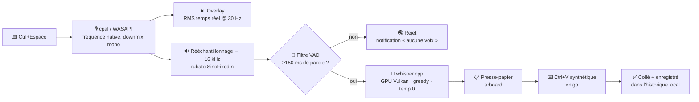

<div align="center">


<br>

**Appuie sur une touche. Parle. Ton texte apparaît — partout dans Windows.**

Hyperwisper est une application de dictée vocale locale. Elle écoute quand tu maintiens un
raccourci, transcrit ta voix avec Whisper **entièrement sur ta machine**, et colle le texte
directement dans la fenêtre active. Pas de cloud. Pas de compte. Pas d'abonnement. Jamais.

[](LICENSE)
[](#pré-requis)
[](https://tauri.app)
[](https://www.rust-lang.org)
[](#confidentialité)
[](#pourquoi-ce-projet-existe)

[English](README.md) · [Démarrage rapide](#démarrage-rapide) · [Comment ça marche](#comment-ça-marche) · [Compiler depuis les sources](#compiler-depuis-les-sources) · [Contribuer](CONTRIBUTING.md)

</div>

---

## Pourquoi ce projet existe

Je payais **environ 100 €/an pour [Superwhisper](https://superwhisper.com)** — une excellente
application, mais réservée à macOS et vendue par abonnement. Je voulais la même magie du
« je maintiens une touche, je parle, j'obtiens du texte » sur Windows, sur mon propre GPU,
gratuitement, et avec la possibilité de modifier son comportement.

Hyperwisper repose donc sur trois principes non négociables :

| | |
|---|---|
| 🔒 **Rien ne quitte la machine** | L'audio est capturé, rééchantillonné et transcrit en local. Aucune télémétrie, aucune statistique d'usage, aucun système de compte, et aucune requête sortante en dehors du téléchargement unique du modèle depuis HuggingFace. La Content-Security-Policy de l'app est limitée à `self`. |
| ⚡ **Assez rapide pour paraître instantané** | Whisper tourne via `whisper.cpp` avec **l'accélération GPU Vulkan compilée par défaut**. Sur un Ryzen 9 5900X + RTX 3060, une dictée typique passe du relâchement de la touche au texte collé en **moins d'une seconde** (contre ~2,5 s en CPU seul). |
| 🎨 **Vraiment agréable à utiliser** | Une interface chaleureuse et discrète — « encre, papier et sable », zéro dégradé violet — avec un overlay flottant déplaçable, une waveform en temps réel et des sons de retour synthétisés. Un outil de dictée qu'on ne se lasse pas de voir 50 fois par jour. |

Le projet est sous licence MIT et gratuit pour toujours. Forke-le, récupère ce qui t'intéresse,
publie ta propre version.

---

## Aperçu

<div align="center">


<br><br>


</div>

> Ce sont des rendus vectoriels de l'overlay réel, dessinés d'après la spécification du composant
> [`src/windows/overlay/OverlayApp.tsx`](src/windows/overlay/OverlayApp.tsx) — mêmes dimensions,
> mêmes couleurs, mêmes états. De vraies captures d'écran de la fenêtre de réglages sont dans la
> [roadmap](#roadmap).

L'overlay existe en deux styles, permutables dans **Réglages → Audio** :

- **Fat** (520×140) — la pill complète : waveform, chrono, bouton d'annulation.
- **Thin** (220×48) — un sliver minimal, juste un point et sept barres.

Les deux flottent au-dessus de toutes les fenêtres, n'apparaissent pas dans la barre des tâches,
ne volent jamais le focus, et se déplacent à la souris — ta position est mémorisée.

---

## Fonctionnalités

**Dictée**
- Raccourci global partout dans Windows — `Ctrl+Espace` par défaut, entièrement reconfigurable
- Mode **Toggle** (une pression pour démarrer, une pour arrêter) ou **Push-to-talk** (maintien)
- `Échap` annule l'enregistrement en cours et jette l'audio
- Collage automatique dans la fenêtre active — Discord, Chrome, VS Code, Word, n'importe quoi
- Préservation optionnelle du presse-papier : ce que tu avais copié est restauré ~250 ms après le collage
- Repli sur « presse-papier seul » avec notification si le `Ctrl+V` synthétique est refusé (fenêtres élevées, certains jeux)

**Transcription**
- Six modèles Whisper, de 32 Mo (Tiny) à 1 Go (Large-v3), téléchargés à la demande
- **Accélération GPU Vulkan** compilée par défaut ; CUDA disponible en feature Cargo optionnelle
- Le modèle par défaut est embarqué dans l'installateur — tu peux dicter dès la fin du setup
- Détection d'activité vocale par énergie : les enregistrements silencieux sont jetés au lieu d'être hallucinés en texte
- Les enregistrements de moins de 250 ms sont ignorés — une pression accidentelle ne coûte rien

**Interface**
- Assistant de démarrage en six étapes : bienvenue → test micro → modèle → raccourci → démarrage auto → fin
- Réglages répartis en panneaux Général, Modèles, Audio, Raccourcis, Historique, Compte et À propos
- Historique local en JSONL append-only, avec copie et suppression par entrée
- Thèmes clair / sombre / système, barre de titre personnalisée, résident dans la barre des tâches (fermer la fenêtre la masque)
- Sons de retour synthétisés en WebAudio pour start, stop, done et cancel — aucun fichier audio embarqué

**Distribution**
- **`.exe` portable auto-installant** — pas de NSIS, pas de MSI, **pas de droits administrateur**
- Installation par utilisateur dans `%LOCALAPPDATA%\Programs\Hyperwisper`
- Entrée correcte dans *Applications installées*, avec un vrai désinstallateur intégré qui nettoie les clés de registre, les raccourcis, le démarrage automatique et les données utilisateur

---

## Comment ça marche



**Étape par étape.** Le raccourci est enregistré via `tauri-plugin-global-shortcut`. Au
déclenchement, la capture audio démarre sur un thread système dédié — `cpal::Stream` n'est pas
`Send`, il ne peut donc pas vivre dans le runtime async. Les échantillons arrivent à la fréquence
native du périphérique en F32, I16 ou U16 ; ils sont convertis et mixés en mono à l'intérieur du
callback audio via un buffer de travail réutilisé, ce qui évite toute allocation par callback.
Un niveau RMS est émis à ~30 Hz pour animer la waveform de l'overlay.

À l'arrêt, le buffer est rééchantillonné vers les 16 kHz exigés par Whisper avec l'interpolateur
sinc de rubato (64 taps, coupure 0,92, suréchantillonnage 32×). Un VAD maison basé sur l'énergie
analyse ensuite des trames de 20 ms et exige un budget cumulé d'au moins 150 ms de parole — les
trames silencieuses ne comptent pas, donc les longues pauses entre deux phrases ne déclenchent
pas de faux négatif.

La transcription s'exécute sur `spawn_blocking` contre un `WhisperContext` résident, en
échantillonnage greedy, température 0, repli de température désactivé, et `n_threads` réglé sur
le nombre de cœurs physiques. `single_segment` est désactivé, donc les dictées de plus de
30 secondes ne sont pas tronquées.

Le texte obtenu est nettoyé, ajouté à l'historique, écrit dans le presse-papier et collé par un
`Ctrl+V` synthétique après un délai de stabilisation de 60 ms — le temps que le focus revienne
sur ta fenêtre cible.

---

## Modèles

Les modèles proviennent de [`ggerganov/whisper.cpp`](https://huggingface.co/ggerganov/whisper.cpp)
sur HuggingFace et sont stockés dans `%APPDATA%\Hyperwisper\models\`.

| Modèle | Taille | Notes |
|---|---:|---|
| `tiny-q5_1` | 32 Mo | Test rapide. Qualité approximative — à éviter au quotidien. |
| `base-q5_1` | 60 Mo | Léger, pour PC modeste. Correct sur des phrases courtes et simples. |
| **`small-q5_1`** | **190 Mo** | **★ Par défaut.** Le meilleur compromis qualité/vitesse, et le modèle embarqué dans l'installateur. |
| `small` | 488 Mo | Small non quantisé. Marginalement plus précis, 2,5× plus lourd. |
| `medium-q5_0` | 539 Mo | Pour les longues dictées techniques. Demande un CPU ou GPU costaud. |
| `large-v3-q5_0` | 1,08 Go | Précision maximale. Lent même en GPU — surdimensionné pour de la dictée. |

> [!NOTE]
> Les téléchargements sont écrits dans un fichier `.part` puis renommés atomiquement à la fin :
> un téléchargement interrompu ne peut pas laisser un modèle corrompu en place. La vérification
> d'empreinte n'est [pas encore implémentée](#limites-connues).

---

## Démarrage rapide

### Pour les utilisateurs

Aucune release précompilée n'est encore publiée — voir la [roadmap](#roadmap). En attendant,
suis [Compiler depuis les sources](#compiler-depuis-les-sources) puis lance `pnpm tauri:build`.

Une fois l'exécutable en main :

1. Lance `Hyperwisper.exe` — il s'ouvre en **auto-installateur**, par utilisateur, sans droits admin.
2. Choisis un dossier d'installation (par défaut `%LOCALAPPDATA%\Programs\Hyperwisper`).
3. Suis l'assistant en six étapes : teste ton micro, confirme le modèle, choisis ton raccourci.
4. Appuie sur `Ctrl+Espace` n'importe où et parle.

Pour désinstaller : **Réglages → À propos → Désinstaller Hyperwisper**, ou l'entrée classique
*Applications installées* de Windows. Les deux suppriment le binaire, les modèles, les réglages,
l'historique, les logs, les raccourcis, le démarrage automatique et les clés de registre.

### Pré-requis

- **Windows 10 ou 11.** L'app est aujourd'hui exclusivement Windows : la simulation de collage
  `enigo`, la capture WASAPI, l'installateur basé sur le registre et l'intégration à la barre des
  tâches sont tous spécifiques à la plateforme.
- Un microphone.
- Un GPU compatible Vulkan est optionnel mais fortement recommandé. `vulkan-1.dll` est fourni avec
  Windows 10+, donc **les utilisateurs finaux n'ont besoin d'aucun SDK** — seuls ceux qui
  compilent le projet en ont besoin.

---

## Compiler depuis les sources

### Chaîne d'outils

Au-delà de Node et Rust, `whisper-rs` compile whisper.cpp **et ses shaders de calcul Vulkan**
depuis les sources, ce qui entraîne quelques dépendances natives :

```powershell
winget install OpenJS.NodeJS.LTS
winget install Rustlang.Rustup
winget install Kitware.CMake            # système de build de whisper.cpp
winget install LLVM.LLVM                # libclang.dll, requis par bindgen
winget install KhronosGroup.VulkanSDK   # nécessaire uniquement pour COMPILER le backend Vulkan
npm install -g pnpm
```

Il te faut aussi la **chaîne d'outils MSVC** (Visual Studio Build Tools avec la charge de travail
*Développement Desktop en C++*).

### Variables d'environnement

Trois variables doivent être définies avant la compilation Rust :

| Variable | Valeur | Pourquoi |
|---|---|---|
| `LIBCLANG_PATH` | `C:\Program Files\LLVM\bin` | bindgen charge `libclang.dll` à la compilation |
| `VULKAN_SDK` | `C:\VulkanSDK\<version>` | localise les en-têtes Vulkan et `glslc` |
| `CARGO_TARGET_DIR` | un chemin **court**, ex. `D:\h` | voir ci-dessous |

> [!WARNING]
> **La surcharge de `CARGO_TARGET_DIR` n'est pas optionnelle.** Le générateur de shaders Vulkan de
> whisper.cpp imbrique ses artefacts sous `ggml-vulkan/vulkan-shaders-gen-prefix/...`, ce qui
> dépasse largement la limite `MAX_PATH` de 260 caractères de Windows depuis un dossier `target/`
> classique. Tu verras un `MSB3491` MSBuild ou des erreurs de chemin obscures. Un dossier de
> build court règle le problème.

[`scripts/dev.ps1`](scripts/dev.ps1) définit les trois et lance le serveur de dev, donc le chemin
nominal tient en une commande :

```powershell
pnpm install
.\scripts\dev.ps1
```

> [!NOTE]
> `dev.ps1` code actuellement en dur `CARGO_TARGET_DIR = D:\h`. Si tu n'as pas de disque `D:`,
> modifie cette ligne vers n'importe quel chemin court sur un disque que tu possèdes — `C:\h`
> fait très bien l'affaire. Rendre ce réglage configurable est une première PR facile.

Compiler un binaire de release :

```powershell
pnpm tauri:build     # → tauri build --features gpu-vulkan
```

> [!TIP]
> `Cargo.toml` déclare `default = ["gpu-vulkan"]`, mais le CLI Tauri invoque cargo avec
> `--no-default-features`. C'est pourquoi les scripts de `package.json` passent explicitement
> `--features gpu-vulkan`. Si tu lances `cargo build` à la main, le défaut s'applique et tu
> obtiens Vulkan quand même.

### Backends GPU

| Feature | Défaut | Notes |
|---|---|---|
| `gpu-vulkan` | ✅ activée | Support matériel le plus large ; le runtime est fourni avec Windows 10+ |
| `gpu-cuda` | optionnelle | NVIDIA uniquement, exige le toolkit CUDA à la compilation |
| *(aucune)* | — | Inférence CPU. Fonctionne très bien, environ 2 à 3× plus lent |

```powershell
pnpm tauri build --no-default-features --features gpu-cuda   # CUDA
pnpm tauri build --no-default-features                       # CPU pur
```

### Dépannage

| Symptôme | Cause |
|---|---|
| `couldn't find any valid shared libraries matching: ['clang.dll', 'libclang.dll']` | LLVM absent ou `LIBCLANG_PATH` non défini |
| `MSB3491` MSBuild, ou erreurs de chemin tronqué | `MAX_PATH` dépassé — définis un `CARGO_TARGET_DIR` court |
| `glslc` introuvable | SDK Vulkan non installé, ou `VULKAN_SDK` non défini |
| La première compilation prend 10 à 20 minutes | Normal. whisper.cpp, les shaders et l'arbre Tauri sont compilés de zéro, puis mis en cache |

---

## Organisation du dépôt

```
hyperwisper/
├── src/                          # Front-end React (TypeScript, Tailwind, Framer Motion)
│   ├── entries/
│   │   ├── settings.tsx          # fenêtre principale — route vers Installateur / Désinstallateur / Réglages
│   │   └── overlay.tsx           # fenêtre overlay transparente toujours au premier plan
│   ├── windows/
│   │   ├── overlay/              # la pill d'enregistrement : waveform, chrono, états
│   │   ├── installer/            # interfaces d'installation et de désinstallation intégrées
│   │   └── settings/
│   │       ├── onboarding/       # assistant de premier lancement en six étapes
│   │       └── panels/           # Général · Modèles · Audio · Raccourcis · Historique · Compte · À propos
│   ├── components/               # Logo, Sidebar, Topbar
│   ├── lib/                      # ipc.ts · events.ts · theme.ts · sounds.ts · toasts.ts
│   └── styles/globals.css        # les tokens de design « Quiet Premium »
│
├── src-tauri/                    # Back-end Rust
│   └── src/
│       ├── lib.rs                # bootstrap, plugins, modes de lancement, registre des commandes
│       ├── recording.rs          # le pipeline de dictée : capture → VAD → transcription → collage
│       ├── audio/                # recorder.rs (capture cpal) · resampler.rs (rubato → 16 kHz)
│       ├── whisper/              # engine.rs · models.rs (catalogue) · downloader.rs
│       ├── hotkey/               # enregistrement du raccourci global, toggle + push-to-talk
│       ├── paste/                # presse-papier arboard + Ctrl+V enigo, avec restauration
│       ├── commands/             # les 28 handlers #[tauri::command]
│       ├── settings.rs           # configuration persistée
│       ├── history.rs            # historique JSONL append-only
│       ├── installer.rs          # auto-installation, raccourcis, registre, auto-suppression
│       ├── tray.rs · system.rs · state.rs
│       └── main.rs
│
├── assets/                       # logo et illustrations de ce README
└── scripts/dev.ps1               # définit toutes les variables d'env, puis lance le serveur de dev
```

Les deux processus dialoguent via **28 commandes Tauri** (typées dans
[`src/lib/ipc.ts`](src/lib/ipc.ts)) et **13 événements** dans l'autre sens (typés dans
[`src/lib/events.ts`](src/lib/events.ts)) — `recording:state`, `recording:level`,
`model:progress`, `history:new`, `hotkey:conflict`, `device:disconnect`, etc.

---

## Confidentialité

C'est la raison d'être du projet, alors soyons précis.

**Ne quitte jamais ta machine :** l'audio capturé, le texte transcrit, l'historique de dictée, les
réglages, les statistiques d'usage. Ces dernières n'existent pas — aucun code de télémétrie ne
figure dans ce dépôt.

**La seule requête sortante** que l'app émet est le téléchargement d'un modèle Whisper depuis
`huggingface.co`, à la demande, quand tu en réclames un. Si tu utilises le modèle par défaut
embarqué, Hyperwisper peut fonctionner indéfiniment sans réseau.

Tout vit dans `%APPDATA%\Hyperwisper\` :

```
settings.json            ta configuration
history.jsonl            chaque dictée, append-only
overlay-position.json    l'endroit où tu as déplacé la pill
models/                  les modèles Whisper téléchargés
logs/                    logs à rotation quotidienne (hyperwisper.log.AAAA-MM-JJ)
```

Supprime ce dossier et Hyperwisper t'oublie complètement.

---

## État du projet

Hyperwisper est en **v0.1.0** — utilisable au quotidien, mais pas encore en 1.0. La boucle
complète de dictée fonctionne : raccourci, capture, VAD, transcription, collage, historique,
réglages, onboarding, installation et désinstallation.

### Limites connues

Autant être franc sur les aspérités, tu les trouveras de toute façon :

- **La langue de transcription est codée en dur sur le français.** `Settings.language` est
  persisté et typé des deux côtés, mais n'est pas encore transmis à `WhisperEngine::load`, et
  aucun panneau de réglages ne l'expose. Changer le littéral dans `lib.rs` et `commands/mod.rs`
  est un correctif de deux lignes ; le brancher proprement à l'UI est une excellente première
  contribution.
- **L'interface est uniquement en français.** Toutes les chaînes sont inline dans les TSX — pas
  encore de couche i18n.
- **Les modèles téléchargés ne sont pas vérifiés par empreinte.** `sha2` est déclaré en dépendance
  et le catalogue mentionne SHA-256 en commentaire, mais l'étape de vérification n'est pas
  implémentée.
- **Modifier une entrée d'historique n'est pas persisté.** Le fichier d'historique est
  append-only par conception ; les modifications restent locales à la session.
- **Windows uniquement.** macOS et Linux nécessiteraient de nouveaux backends de collage, de
  barre des tâches et d'installation.
- **Pas encore de release précompilée**, et le binaire n'est pas signé — attends-toi à un
  avertissement SmartScreen.

### Roadmap

- [ ] Binaires de release signés sur GitHub Releases
- [ ] Sélection de la langue dans l'interface (et détection `auto`)
- [ ] Interface en anglais + une couche i18n
- [ ] Vraies captures d'écran et GIF de démonstration dans ce README
- [ ] Vérification SHA-256 des modèles téléchargés
- [ ] Vocabulaire personnalisé / dictionnaire de remplacement pour les noms propres et le jargon
- [ ] Profils par application
- [ ] Support macOS et Linux

---

## Contributions recherchées

Bons points d'entrée si tu veux contribuer — aucun ne demande de comprendre tout le code :

| Tâche | Où | Difficulté |
|---|---|---|
| Traduire l'interface en anglais | `src/windows/**/*.tsx` | 🟢 Facile, fastidieux |
| Exposer le choix de la langue dans les réglages | `GeneralPanel.tsx` + `whisper/engine.rs` | 🟢 Facile |
| Vérification SHA-256 après téléchargement | `whisper/downloader.rs` | 🟡 Moyen |
| Vocabulaire personnalisé via `set_initial_prompt` | `whisper/engine.rs` | 🟡 Moyen |
| Backend collage + barre des tâches pour macOS | `paste/`, `tray.rs` | 🔴 Difficile |

Voir [CONTRIBUTING.md](CONTRIBUTING.md) pour l'installation, les conventions et les attentes de PR.

---

## FAQ

<details>
<summary><b>Est-ce que de l'audio ou du texte part vers un serveur ?</b></summary><br>

Non. L'inférence tourne en local via whisper.cpp. L'app applique une Content-Security-Policy
limitée à `self` et n'embarque aucune analytique. Le seul appel réseau du code est le
téléchargement de modèle HuggingFace dans `whisper/downloader.rs`, qui ne s'exécute que si tu
demandes explicitement un modèle.
</details>

<details>
<summary><b>Pourquoi <code>Ctrl+Espace</code> par défaut ? Ça ne rentre pas en conflit avec les IME ?</b></summary><br>

Si, sur les systèmes avec un IME chinois, japonais ou coréen installé — `Ctrl+Espace` y bascule
le mode de saisie. L'app détecte l'échec d'enregistrement et affiche une notification
`hotkey:conflict` proposant des alternatives. `Ctrl+Maj+Espace` et `F8` fonctionnent bien.
</details>

<details>
<summary><b>Est-ce que ça tourne sans GPU ?</b></summary><br>

Oui. Compile avec `--no-default-features` pour une inférence CPU pure. Compte environ 2 à 3× la
latence ; Small Q5_1 reste parfaitement utilisable sur un CPU moderne.
</details>

<details>
<summary><b>Pourquoi le collage ne fonctionne pas dans certaines fenêtres ?</b></summary><br>

Les frappes synthétiques sont refusées par les fenêtres qui tournent à un niveau d'intégrité
supérieur à Hyperwisper (applications élevées) et par certains jeux utilisant le raw input. Dans
ce cas le texte reste dans ton presse-papier et une notification t'invite à faire `Ctrl+V`
toi-même.
</details>

<details>
<summary><b>Pourquoi un installateur maison plutôt qu'un MSI ou un NSIS ?</b></summary><br>

Le bundler de Tauri est désactivé (`bundle.active: false`). Livrer un unique `.exe` portable
auto-installant évite les droits admin, supprime la dépendance à un framework d'installation, et
donne un contrôle total sur l'expérience de premier lancement — l'interface d'installation n'est
qu'une vue React de plus dans le même binaire.
</details>

<details>
<summary><b>Puis-je l'utiliser commercialement ?</b></summary><br>

Oui. Licence MIT. Forke, rebrande, vends — garde simplement la notice de copyright.
</details>

---

## Construit avec

[Tauri 2](https://tauri.app) · [whisper.cpp](https://github.com/ggerganov/whisper.cpp) via
[whisper-rs](https://github.com/tazz4843/whisper-rs) · [cpal](https://github.com/RustAudio/cpal) ·
[rubato](https://github.com/HEnquist/rubato) · [enigo](https://github.com/enigo-rs/enigo) ·
[arboard](https://github.com/1Password/arboard) · [React](https://react.dev) ·
[Tailwind CSS](https://tailwindcss.com) · [Framer Motion](https://www.framer.com/motion/) ·
[Radix UI](https://www.radix-ui.com) · [Lucide](https://lucide.dev)

Un immense merci à **Georgi Gerganov** pour whisper.cpp et à **OpenAI** pour la publication des
poids Whisper — sans l'un ou l'autre, rien de tout ceci n'existerait.

## Licence

[MIT](LICENSE) © 2026 Mathew Simon.

Gratuit pour toujours, dans les deux sens du terme. Si tu construis quelque chose avec, ça me
ferait sincèrement plaisir de le savoir.

<div align="center">
<br>

<br><br>
<sub>Fait en France · Parce que parler est 3× plus rapide que taper.</sub>
</div>
