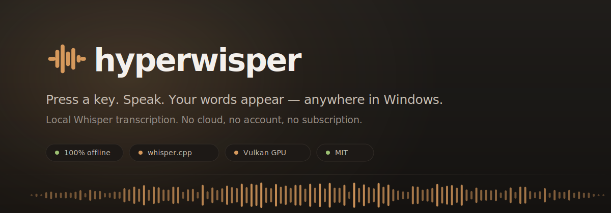
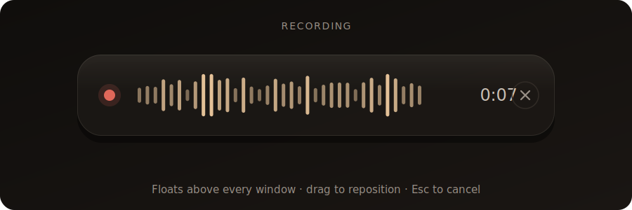
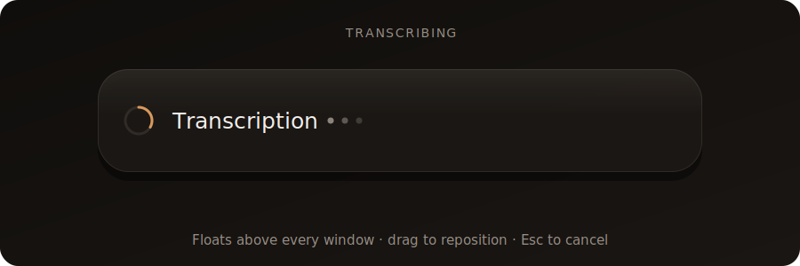
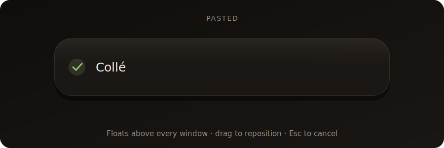
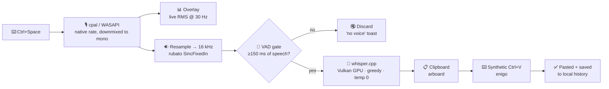

<div align="center">



<br>

**Press a key. Speak. Your words appear — anywhere in Windows.**

Hyperwisper is a local voice-to-text dictation app. It listens when you hold a hotkey,
transcribes your speech with Whisper **entirely on your machine**, and pastes the text
straight into whatever window has focus. No cloud. No account. No subscription. Ever.

[](LICENSE)
[](#requirements)
[](https://tauri.app)
[](https://www.rust-lang.org)
[](#privacy)
[](#why-this-exists)

[Français](README.fr.md) · [Quick start](#quick-start) · [How it works](#how-it-works) · [Build from source](#build-from-source) · [Contributing](CONTRIBUTING.md)

</div>

> [!IMPORTANT]
> **The app's interface is currently French-only**, and the Whisper engine is loaded with
> French as its transcription language. Everything else — code, comments, docs — is English,
> and the strings live in ordinary TSX files, so translating is a mechanical job.
> See [Help wanted](#help-wanted) if you'd like to take it on.

---

## Why this exists

I was paying **~€100/year for [Superwhisper](https://superwhisper.com)** — an excellent app,
but macOS-only and subscription-based. I wanted the same "hold a key, talk, get text" magic on
Windows, running on my own GPU, for free, and I wanted to be able to change how it behaves.

So Hyperwisper was built around three non-negotiables:

| | |
|---|---|
| 🔒 **Nothing leaves the machine** | Audio is captured, resampled and transcribed locally. There is no telemetry, no analytics, no account system, and no outbound network request other than the one-time model download from HuggingFace. The app's Content-Security-Policy is `self`-only. |
| ⚡ **Fast enough to feel instant** | Whisper runs through `whisper.cpp` with **Vulkan GPU acceleration compiled in by default**. On a Ryzen 9 5900X + RTX 3060, a typical dictation goes from key-release to pasted text in **under a second** (it was ~2.5 s on CPU alone). |
| 🎨 **Actually nice to use** | A warm, quiet interface — "ink, paper and sand", no purple gradients — with a draggable floating overlay, a live waveform, and synthesized audio cues. Dictation software you don't mind seeing 50 times a day. |

It's MIT-licensed and free forever. Fork it, rip out the parts you like, ship your own.

---

## Screens

<div align="center">



<br><br>




</div>

> These are vector renderings of the real overlay, drawn from the component spec in
> [`src/windows/overlay/OverlayApp.tsx`](src/windows/overlay/OverlayApp.tsx) — same geometry,
> same colours, same states. Photographic screenshots of the settings window are on the
> [roadmap](#roadmap).

The overlay comes in two flavours, switchable in **Settings → Audio**:

- **Fat** (520×140) — the full pill: waveform, timer, cancel button.
- **Thin** (220×48) — a minimal sliver, just a dot and seven bars.

Both float above every window, skip the taskbar, never steal focus, and can be dragged
anywhere on screen — your position is remembered.

---

## Features

**Dictation**
- Global hotkey anywhere in Windows — default `Ctrl+Space`, fully rebindable
- **Toggle** mode (press to start, press to stop) or **Push-to-talk** (hold while speaking)
- `Esc` cancels an in-flight recording, discarding the audio
- Auto-paste into the focused window — Discord, Chrome, VS Code, Word, anything
- Optional clipboard preservation: whatever you had copied is restored ~250 ms after the paste
- Falls back to clipboard-only with a toast if synthetic `Ctrl+V` is refused (elevated windows, some games)

**Transcription**
- Six Whisper models, from 32 MB Tiny to 1 GB Large-v3, downloaded on demand
- **Vulkan GPU acceleration** compiled in by default; CUDA available as an opt-in Cargo feature
- The default model ships with the installer — you can dictate the moment setup finishes
- Energy-based voice activity detection: silence-only recordings are dropped instead of hallucinated into text
- Recordings under 250 ms are ignored, so a stray keypress costs you nothing

**Interface**
- Six-step onboarding wizard: welcome → mic test → model → hotkey → autostart → done
- Settings across General, Models, Audio, Shortcuts, History and About panels
- Local history in append-only JSONL, with per-entry copy and delete
- Light / dark / system themes, custom title bar, tray-resident (closing the window just hides it)
- Synthesized WebAudio cues for start, stop, done and cancel — no audio files shipped

**Distribution**
- **Self-installing portable `.exe`** — no NSIS, no MSI, **no administrator rights**
- Installs per-user to `%LOCALAPPDATA%\Programs\Hyperwisper`
- Registers properly in *Installed apps*, with a real in-app uninstaller that cleans registry keys, shortcuts, autostart and user data

---

## How it works



**Step by step.** The hotkey is registered through `tauri-plugin-global-shortcut`. On trigger,
audio capture starts on a dedicated OS thread — `cpal::Stream` isn't `Send`, so it can't live on
the async runtime. Samples arrive at the device's native rate in F32, I16 or U16; they're
converted and downmixed to mono inside the audio callback using a reused scratch buffer, so no
allocation happens per callback. An RMS level is emitted at ~30 Hz to drive the overlay waveform.

On stop, the buffer is resampled to Whisper's required 16 kHz using rubato's sinc interpolator
(64-tap, 0.92 cutoff, 32× oversampling). A custom energy-based VAD then scans 20 ms frames and
requires a cumulative speech budget of at least 150 ms — silent frames contribute nothing, so
long pauses between phrases don't trip a false negative.

Transcription runs on `spawn_blocking` against a resident `WhisperContext`, with greedy sampling,
temperature 0, temperature-fallback disabled, and `n_threads` set to the physical core count.
`single_segment` is off, so dictations longer than 30 seconds aren't truncated.

The resulting text is trimmed, appended to history, written to the clipboard, and pasted with a
synthetic `Ctrl+V` after a 60 ms settle delay — enough for focus to return to your target window.

---

## Models

Models are pulled from [`ggerganov/whisper.cpp`](https://huggingface.co/ggerganov/whisper.cpp) on
HuggingFace and stored in `%APPDATA%\Hyperwisper\models\`.

| Model | Size | Notes |
|---|---:|---|
| `tiny-q5_1` | 32 MB | Fast smoke test. Quality is rough — not for daily use. |
| `base-q5_1` | 60 MB | Light enough for modest hardware. OK on short, simple sentences. |
| **`small-q5_1`** | **190 MB** | **★ Default.** The best quality/speed trade-off, and what ships with the installer. |
| `small` | 488 MB | Unquantized Small. Marginally more accurate, 2.5× heavier. |
| `medium-q5_0` | 539 MB | For long technical dictations. Wants a strong CPU or GPU. |
| `large-v3-q5_0` | 1.08 GB | Maximum accuracy. Slow even on GPU — overkill for dictation. |

> [!NOTE]
> Downloads are streamed to a `.part` file and atomically renamed on completion, so an
> interrupted download can't leave a corrupt model in place. Checksum verification is
> [not yet implemented](#known-gaps).

---

## Quick start

### For users

No prebuilt release is published yet — see the [roadmap](#roadmap). Until then, follow
[Build from source](#build-from-source) and run `pnpm tauri:build`.

Once you have the executable, the flow is:

1. Run `Hyperwisper.exe` — it opens as a **self-installer**, per-user, no admin rights.
2. Pick an install directory (defaults to `%LOCALAPPDATA%\Programs\Hyperwisper`).
3. Complete the six-step wizard: test your mic, confirm the model, choose your hotkey.
4. Press `Ctrl+Space` anywhere and start talking.

To uninstall: **Settings → About → Uninstall Hyperwisper**, or the standard Windows
*Installed apps* entry. Both remove the binary, models, settings, history, logs, shortcuts,
autostart entry and registry keys.

### Requirements

- **Windows 10 or 11.** The app is Windows-only today: `enigo` paste simulation, WASAPI capture,
  the registry-based installer and the tray integration are all platform-specific.
- A microphone.
- A Vulkan-capable GPU is optional but strongly recommended. `vulkan-1.dll` ships with Windows 10+,
  so **end users need no SDK** — only people compiling the project do.

---

## Build from source

### Toolchain

Beyond Node and Rust, `whisper-rs` compiles whisper.cpp **and its Vulkan compute shaders** from
source, which pulls in a few native dependencies:

```powershell
winget install OpenJS.NodeJS.LTS
winget install Rustlang.Rustup
winget install Kitware.CMake            # whisper.cpp build system
winget install LLVM.LLVM                # libclang.dll, required by bindgen
winget install KhronosGroup.VulkanSDK   # only needed to COMPILE the Vulkan backend
npm install -g pnpm
```

You also need the **MSVC toolchain** (Visual Studio Build Tools with the *Desktop development
with C++* workload).

### Environment

Two variables must be set before the Rust build:

| Variable | Value | Why |
|---|---|---|
| `LIBCLANG_PATH` | `C:\Program Files\LLVM\bin` | bindgen loads `libclang.dll` at build time |
| `VULKAN_SDK` | `C:\VulkanSDK\<version>` | locates the Vulkan headers and `glslc` |
| `CARGO_TARGET_DIR` | a **short** path, e.g. `D:\h` | see below |

> [!WARNING]
> **The `CARGO_TARGET_DIR` override is not optional.** whisper.cpp's Vulkan shader generator
> nests build artifacts under `ggml-vulkan/vulkan-shaders-gen-prefix/...`, which blows past
> Windows' 260-character `MAX_PATH` limit from a normal `target/` directory. You'll see MSBuild
> `MSB3491` or opaque path errors. A short target directory is the fix.

[`scripts/dev.ps1`](scripts/dev.ps1) sets all three and launches the dev server, so the happy
path is one command:

```powershell
pnpm install
.\scripts\dev.ps1
```

> [!NOTE]
> `dev.ps1` currently hardcodes `CARGO_TARGET_DIR = D:\h`. If you don't have a `D:` drive,
> edit that line to any short path on a drive you do have — `C:\h` works fine. Making this
> configurable is an easy first PR.

Building a release binary:

```powershell
pnpm tauri:build     # → tauri build --features gpu-vulkan
```

> [!TIP]
> `Cargo.toml` declares `default = ["gpu-vulkan"]`, but the Tauri CLI invokes cargo with
> `--no-default-features`. That's why the `package.json` scripts pass `--features gpu-vulkan`
> explicitly. If you run `cargo build` by hand, the default applies and you get Vulkan anyway.

### GPU backends

| Feature | Default | Notes |
|---|---|---|
| `gpu-vulkan` | ✅ on | Broadest hardware support; runtime ships with Windows 10+ |
| `gpu-cuda` | opt-in | NVIDIA only, needs the CUDA toolkit at build time |
| *(neither)* | — | CPU inference. Works fine, roughly 2–3× slower |

```powershell
pnpm tauri build --no-default-features --features gpu-cuda   # CUDA
pnpm tauri build --no-default-features                       # pure CPU
```

### Troubleshooting

| Symptom | Cause |
|---|---|
| `couldn't find any valid shared libraries matching: ['clang.dll', 'libclang.dll']` | LLVM missing or `LIBCLANG_PATH` unset |
| MSBuild `MSB3491`, or truncated/odd path errors | `MAX_PATH` exceeded — set a short `CARGO_TARGET_DIR` |
| `glslc` not found | Vulkan SDK not installed, or `VULKAN_SDK` unset |
| First build takes 10–20 minutes | Expected. whisper.cpp + shaders + the Tauri tree are compiled from scratch, then cached |

---

## Repository layout

```
hyperwisper/
├── src/                          # React front-end (TypeScript, Tailwind, Framer Motion)
│   ├── entries/
│   │   ├── settings.tsx          # main window — routes to Installer / Uninstaller / Settings
│   │   └── overlay.tsx           # transparent always-on-top overlay window
│   ├── windows/
│   │   ├── overlay/              # the recording pill: waveform, timer, states
│   │   ├── installer/            # in-app installer + uninstaller UIs
│   │   └── settings/
│   │       ├── onboarding/       # six-step first-run wizard
│   │       └── panels/           # General · Models · Audio · Shortcuts · History · Account · About
│   ├── components/               # Logo, Sidebar, Topbar
│   ├── lib/                      # ipc.ts · events.ts · theme.ts · sounds.ts · toasts.ts
│   └── styles/globals.css        # the "Quiet Premium" design tokens
│
├── src-tauri/                    # Rust back-end
│   └── src/
│       ├── lib.rs                # bootstrap, plugins, run modes, command registry
│       ├── recording.rs          # the dictation pipeline: capture → VAD → transcribe → paste
│       ├── audio/                # recorder.rs (cpal capture) · resampler.rs (rubato → 16 kHz)
│       ├── whisper/              # engine.rs · models.rs (catalog) · downloader.rs
│       ├── hotkey/               # global shortcut registration, toggle + push-to-talk
│       ├── paste/                # arboard clipboard + enigo Ctrl+V, with restore
│       ├── commands/             # the 28 #[tauri::command] handlers
│       ├── settings.rs           # persisted config
│       ├── history.rs            # append-only JSONL history
│       ├── installer.rs          # self-install, shortcuts, registry, self-delete
│       ├── tray.rs · system.rs · state.rs
│       └── main.rs
│
├── assets/                       # logo and artwork for this README
└── scripts/dev.ps1               # sets every env var, then launches the dev server
```

The two processes talk over **28 Tauri commands** (typed in [`src/lib/ipc.ts`](src/lib/ipc.ts))
and **13 events** flowing the other way (typed in [`src/lib/events.ts`](src/lib/events.ts)) —
`recording:state`, `recording:level`, `model:progress`, `history:new`, `hotkey:conflict`,
`device:disconnect` and friends.

---

## Privacy

This is the whole point of the project, so let's be precise about it.

**Never leaves your machine:** captured audio, transcribed text, dictation history, settings,
usage statistics. There are none of the latter — no telemetry code exists in this repository.

**The only outbound request** the app ever makes is downloading a Whisper model from
`huggingface.co`, on demand, when you ask for one. If you use the bundled default model,
Hyperwisper can run with the network disabled forever.

Everything lives in `%APPDATA%\Hyperwisper\`:

```
settings.json            your configuration
history.jsonl            every dictation, append-only
overlay-position.json    where you dragged the pill
models/                  downloaded Whisper models
logs/                    daily-rotated logs (hyperwisper.log.YYYY-MM-DD)
```

Delete that folder and Hyperwisper forgets you completely.

---

## Status

Hyperwisper is **v0.1.0** — daily-driver usable, not yet 1.0. The full dictation loop works:
hotkey, capture, VAD, transcription, paste, history, settings, onboarding, install and uninstall.

### Known gaps

Being upfront about the rough edges, because you'll find them anyway:

- **The transcription language is hardcoded to French.** `Settings.language` is persisted and
  typed on both sides, but it isn't threaded into `WhisperEngine::load` yet, and no settings
  panel exposes it. Changing the literal in `lib.rs` and `commands/mod.rs` is a two-line fix;
  wiring it to the UI properly is a good first contribution.
- **The UI is French-only.** All strings are inline in TSX — no i18n framework yet.
- **Downloaded models aren't checksum-verified.** `sha2` is a declared dependency and the model
  catalog has a comment about SHA-256, but the verification step isn't implemented.
- **Editing a history entry doesn't persist.** The history file is append-only by design; edits
  are local to the session.
- **Windows only.** macOS and Linux would need new paste, tray and installer backends.
- **No prebuilt releases yet**, and the binary is unsigned — expect a SmartScreen warning.

### Roadmap

- [ ] Signed release binaries on GitHub Releases
- [ ] Language selection in the UI (and `auto` detection)
- [ ] English UI + an i18n layer
- [ ] Real screenshots and a demo GIF in this README
- [ ] SHA-256 verification of downloaded models
- [ ] Custom vocabulary / replacement dictionary for names and jargon
- [ ] Per-application profiles
- [ ] macOS and Linux support

---

## Help wanted

Good entry points if you'd like to contribute — none of these require understanding the whole
codebase:

| Task | Where | Difficulty |
|---|---|---|
| Translate the UI to English | `src/windows/**/*.tsx` | 🟢 Easy, tedious |
| Expose language selection in Settings | `GeneralPanel.tsx` + `whisper/engine.rs` | 🟢 Easy |
| SHA-256 verification after download | `whisper/downloader.rs` | 🟡 Medium |
| Custom vocabulary via `set_initial_prompt` | `whisper/engine.rs` | 🟡 Medium |
| macOS paste + tray backend | `paste/`, `tray.rs` | 🔴 Hard |

See [CONTRIBUTING.md](CONTRIBUTING.md) for setup, conventions and PR expectations.

---

## FAQ

<details>
<summary><b>Does any audio or text reach a server?</b></summary><br>

No. Inference runs locally through whisper.cpp. The app has a `self`-only Content-Security-Policy
and no analytics. The only network call in the codebase is the HuggingFace model download in
`whisper/downloader.rs`, which only runs when you explicitly request a model.
</details>

<details>
<summary><b>Why is <code>Ctrl+Space</code> the default? Doesn't that conflict with IMEs?</b></summary><br>

It does, on systems with a Chinese, Japanese or Korean IME installed — `Ctrl+Space` toggles
input modes there. The app detects a failed registration and raises a `hotkey:conflict` toast
suggesting alternatives. `Ctrl+Shift+Space` and `F8` both work well.
</details>

<details>
<summary><b>Can I run it without a GPU?</b></summary><br>

Yes. Build with `--no-default-features` for pure CPU inference. Expect roughly 2–3× the latency;
Small Q5_1 is still perfectly usable on a modern CPU.
</details>

<details>
<summary><b>Why doesn't the paste work in some windows?</b></summary><br>

Synthetic keystrokes are refused by windows running at a higher integrity level than
Hyperwisper (elevated apps) and by some games using raw input. When that happens the text is
still on your clipboard and a toast tells you to press `Ctrl+V` yourself.
</details>

<details>
<summary><b>Why a custom installer instead of MSI or NSIS?</b></summary><br>

Tauri's bundler is disabled (`bundle.active: false`). Shipping a single self-installing portable
`.exe` means no admin rights, no installer framework dependency, and full control over the
first-run experience — the installer UI is just another React view in the same binary.
</details>

<details>
<summary><b>Can I use this commercially?</b></summary><br>

Yes. MIT. Fork it, rebrand it, sell it — just keep the copyright notice.
</details>

---

## Built with

[Tauri 2](https://tauri.app) · [whisper.cpp](https://github.com/ggerganov/whisper.cpp) via
[whisper-rs](https://github.com/tazz4843/whisper-rs) · [cpal](https://github.com/RustAudio/cpal) ·
[rubato](https://github.com/HEnquist/rubato) · [enigo](https://github.com/enigo-rs/enigo) ·
[arboard](https://github.com/1Password/arboard) · [React](https://react.dev) ·
[Tailwind CSS](https://tailwindcss.com) · [Framer Motion](https://www.framer.com/motion/) ·
[Radix UI](https://www.radix-ui.com) · [Lucide](https://lucide.dev)

Enormous thanks to **Georgi Gerganov** for whisper.cpp and to **OpenAI** for releasing the
Whisper weights — without either, none of this is possible.

## License

[MIT](LICENSE) © 2026 Mathew Simon.

Free forever, in both senses. If you build something with it, I'd genuinely love to hear about it.

<div align="center">
<br>

<br><br>
<sub>Made in France · Because talking is 3× faster than typing.</sub>
</div>
